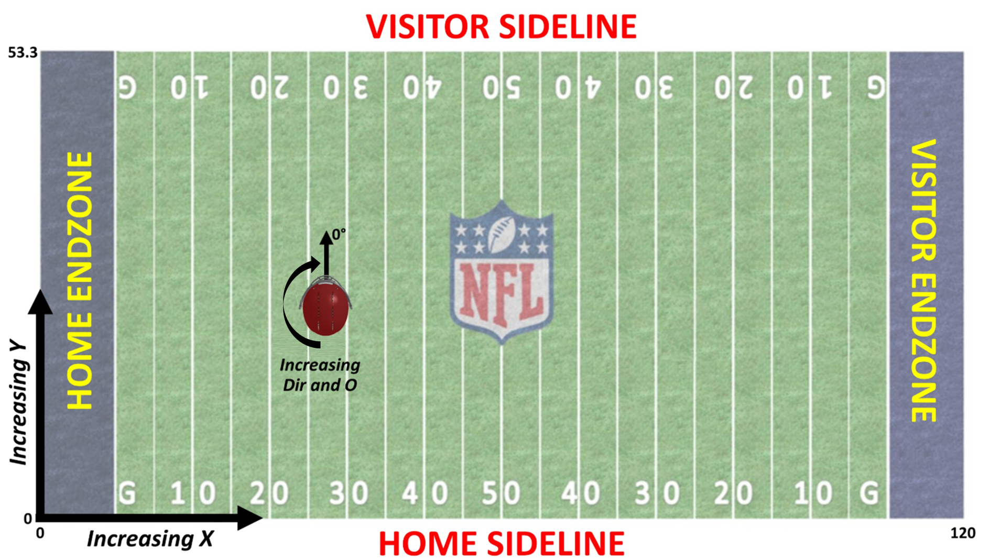

# Dataset Description
### Summary of data
Here, you'll find a summary of each data set in the 2025 Data Bowl, a list of key variables to join on, and a description of each variable. The tracking data is provided by the NFL Next Gen Stats team. The columns labeled with a prefix of "pff_" are provided by Pro Football Focus.

### Supplemental Data
The 2025 Big Data Bowl allows participants to use supplemental NFL data as long as it is free and publicly available to all participants. Examples of sources that could be used include nflverse and Pro Football Reference. Please note that the gameId and playId of the Big Data Bowl data merges with the old_game_id and play_id of nflverse's play-by-play data.

### File descriptions
- Game data: The `games.csv` contains the teams playing in each game. The key variable is `gameId`.
- Play data: The `plays.csv` file contains play-level information from each game. The key variables are `gameId` and `playId`.
- Player data: The `players.csv` file contains player-level information from players that participated in any of the tracking data files. The key variable is `nflId`.
- Player play data: The `player_play.csv` file contains player-level stats for each game and play. The key variables are `gameId`, `playId`, and `nflId`.
- Tackles data: The `tackles.csv` file contains player-level tackle information for each game and play. The key variables are `gameId`, `playId`, and `nflId`.
- Tracking data: Files `tracking_week_[week].csv` contain player tracking data from week number `[week]`. The key variables are `gameId`, `playId`, and `nflId`.

### Game data
- **`gameId`**: Game identifier, unique (numeric)
- `season`: Season of game
- `week`: Week of game
- `gameDate`: Game Date (time, mm/dd/yyyy)
- `gameTimeEastern`: Start time of game (time, HH:MM:SS, EST)
- `homeTeamAbbr`: Home team three-letter code (text)
- `visitorTeamAbbr`: Visiting team three-letter code (text)
- `homeFinalScore`: The total amount of points scored by the home team in the game (numeric)
- `visitorFinalScore`: The total amount of points scored by the visiting team in the game (numeric)

### Play data
- `gameId`: Game identifier, unique (numeric)
- `playId`: Play identifier, not unique across games (numeric)
- `playDescription`: Description of play (text)
- `quarter`: Game quarter (numeric)
- `down`: Down (numeric)
- `yardsToGo`: Distance needed for a first down (numeric)
- `possessionTeam`: Team abbr of team on offense with possession of ball (text)
- `defensiveTeam`: Team abbr of team on defense (text)
- `yardlineSide`: 3-letter team code corresponding to line-of-scrimmage (text)
- `yardlineNumber`: Yard line at line-of-scrimmage (numeric)
- `gameClock`: Time on clock of play (MM:SS)
- `preSnapHomeScore`: Home score prior to the play (numeric)
- `preSnapVisitorScore`: Visiting team score prior to the play (numeric)
- `playNullifiedByPenalty`: Whether or not an accepted penalty on the play cancels the play outcome. Y stands for yes and N stands for no. (text)
- `absoluteYardlineNumber`: Distance from end zone for possession team (numeric)
- `preSnapHomeTeamWinProbability`: The win probability of the home team before the play (numeric)
- `preSnapVisitorTeamWinProbability`: The win probability of the visiting team before the play (numeric)
- `expectedPoints`: Expected points on this play (numeric)
- `offenseFormation`: Formation used by possession team (text)
- `receiverAlignment`: Enumerated as 0x0, 1x0, 1x1, 2x0, 2x1, 2x2, 3x0, 3x1, 3x2 (text)
- `playClockAtSnap`: What the play clock value was at time of snap (numeric)
- `passResult`: Dropback outcome of the play (C: Complete pass, I: Incomplete pass, S: Quarterback sack, IN: Intercepted pass, R: Scramble, text)
- `passLength`: The distance beyond the LOS that the ball traveled not including yards into the endzone. If thrown behind LOS, the value is negative. (numeric)
- `targetX`: The x-coordinate of the targeted receiver when the pass arrived (numeric)
- `targetY`: The y-coordinate of the targeted receiver when the pass arrived (numeric)
- `playAction`: Boolean indicating whether there was play-action on the play (Boolean)
- `dropbackType`: The type of drop back after the snap by the QB (Traditional, Designed Rollout, Scramble, Scramble Rollout, Designed Rollout Left, Designed Rollout Right, Scramble Rollout Left, Scramble Rollout Right, Designed Run, QB Draw, Rollout, text)
- `dropbackDistance`: The distance the QB dropped back (yards) behind the center after the snap (numeric)
- `passLocationType`: The location type of where the QB was at the time of throw (Inside Tackle Box, Outside Left, Outside Right, Unknown, text)
- `timeToThrow`: The time (secs) elapsed between snap and pass (numeric)
- `timeInTackleBox`: The amount of time the QB spent inside the tackle box (numeric)
- `timeToSack`: The time from snap to the time the QB was sacked (numeric)
- `passTippedAtLine`: Boolean indicating whether the pass was tipped at the line of scrimmage (Boolean)
- `unblockedPressure`: Boolean indicating whether there was pressure from an unblocked player (Boolean)
- `qbSpike`: Boolean indicating whether the play was a QB Spike (Boolean)
- `qbKneel`: Whether or not the play was a QB Kneel (numeric)
- `qbSneak`: Whether or not the play was a QB Sneak (numeric)
- `rushLocationType`: The direction the runner ran based on where the offensive linemen were during the play (Inside left, Inside right, Outside left, Outside right, Unknown, text)
- `penaltyYards`: yards gained by offense by penalty (numeric)
- `prePenaltyYardsGained`: Net yards gained by the offense, before penalty yardage (numeric)
- `yardsGained`: Net yards gained by the offense, including penalty yardage (numeric)
- `homeTeamWinProbabilityAdded`: Win probability delta for home team (numeric)
- `visitorTeamWinProbabilityAdded`: Win probability delta for visitor team (numeric)
- `expectedPointsAdded`: Expected points added on this play (numeric)
- `isDropback`: Boolean indicating whether the QB dropped back, meaning the play resulted in a pass, sack, or scramble (Boolean)
- `pff_runConceptPrimary`: The primary run concept on the play (text)
- `pff_runConceptSecondary`: The secondary run concept on the play (text)
- `pff_runPassOption`: Whether or not the play was a run-pass option (numeric)
- `pff_passCoverage`: The pass coverage concept employed by the defense on the play (text)
- `pff_manZone`: Whether the defense employed man or zone coverage on the play (text)

### Player Play data
- `gameId`: Game identifier, unique (numeric)
- `playId`: Play identifier, not unique across games (numeric)
- `nflId`: Player identification number, unique across players (numeric)
- `teamAbbr`: The team abbreviation for the team the player plays for (text)
- `hadRushAttempt`: Whether or not the player had a rushing attempt on this play (numeric)
- `rushingYards`: The rush yards accrued by the player on this play (numeric)
- `hadDropback`: Whether or not the player dropped back on this play (numeric)
- `passingYards`: The pass yards accrued by the player on this play (numeric)
- `sackYardsOffense`: The yards lost by the player via a sack on this play (numeric)
- `hadPassReception`: Whether or not the player caught a pass on this play (numeric)
- `receivingYards`: The receiving yards accrued by the player on this play (numeric)
- `wasTargettedReceiver`: Whether or not the player was the intended receiver on this play (numeric)
- `yardageGainedAfterTheCatch`: The yards gained after the catch was made by the player on this play (numeric)
- `fumbles`: The number of fumbles by the player on this play (numeric)
- `fumbleLost`: Whether or not the player lost a fumble to the opposing team on this play (numeric)
- `fumbleOutOfBounds`: Whether or not the player fumbled the ball out of bounds on this play (numeric)
- `assistedTackle`: Whether or not the player required an assist to make a tackle on this play (numeric)
- `forcedFumbleAsDefense`: Whether or not the player forced a fumble by the opposing team on this play (numeric)
- `halfSackYardsAsDefense`: The yards conceded by the offense because of a half-sack by the player on this play (numeric)
- `passDefensed`: Whether or not a passing play was stopped by the player on this play (numeric)
- `quarterbackHit`: Whether or not the player recorded a QB hit on this play (numeric)
- `sackYardsAsDefense`: The yards conceded by the offense because of a sack by the player on this play (numeric)
- `safetyAsDefense`: Whether or not the player forced a safety on this play (numeric)
- `soloTackle`: Whether or not the player recorded a solo tackle on this play (numeric)
- `tackleAssist`: Whether or not the player was awarded an assisted tackle on this play (numeric)
- `tackleForALoss`: Whether or not the player recorded a tackle behind the line of scrimmage on this play (numeric)
- `tackleForALossYardage`: The yards conceded by the offense because of a tackle behind the line of scrimmage by the player on this play (numeric)
- `hadInterception`: Whether or not the player intercepted a pass on this play (numeric)
- `interceptionYards`: The yards returned by the player on an intercepted pass on this play (numeric)
- `fumbleRecoveries`: The number of fumbles recovered by the player on this play (numeric)
- `fumbleRecoveryYards`: The yards returned by the player on a fumble recovery on this play (numeric)
- `wasInitialPassRusher`: Whether or not the player was the initial pass rusher on this play (numeric)
- `penaltyNames`: The names of all the penalties that were called on this player on this play (text)
- `causedPressure`: Boolean indicating whether the player pressured the QB, defined as achieving a peak pressure probability greater than or equal to 0.75 over the course of a dropback (Boolean)
- `timeToPressureAsPassRusher`: The time elapsed from snap to the first instance of this player reaching a pressure probability greater than or equal to 0.75 (numeric)
- `getOffAsPassRusher`: The time it took for this player to cross the line of scrimmage as a pass rusher after the ball was snapped (numeric)
- `inMotionAtBallSnap`: Boolean indicating whether the player was in motion at snap; Rule: If a player is moving faster than 0.62 y/s in the window 0.4 seconds prior to the ball snap, and has moved at least 1.2 yards in that window. (Boolean)
- `shiftSinceLineset`: Boolean indicating whether the player shifted since the lineset; Rule: Each player has their own lineset moment, and whether they shift is based on if they move more than 2.5 yards from where they were at their lineset moment. (Boolean)
- `motionSinceLineset`: Boolean indicating whether the player went in motion after they were initially set at the line on this play (Boolean)
- `wasRunningRoute`: Boolean indicating if the player was running a route on this play (Boolean)
- `routeRan`: The name of the route ran by the player on this play (text)
- `blockedPlayerNFLId1`: The NFL player ID of the primary opponent being blocked by the player on this play (numeric)
- `blockedPlayerNFLId2`: The NFL player ID of the secondary opponent being blocked by the player on this play (numeric)
- `blockedPlayerNFLId3`: The NFL player ID of the tertiary opponent being blocked by the player on this play (numeric)
- `pressureAllowedAsBlocker`: Whether or not any of any of the pass rushers that the blocker had a true matchup against recorded a pressure on this play (numeric)
- `timeToPressureAllowedAsBlocker`: The time elapsed from snap to the first instance of a pass rusher who the blocker had a true matchup against achieving a pressure probability above 0.75 on this play (numeric)
- `pff_defensiveCoverageAssignment`: The specific defensive coverage assignment given to the player on this play (text)
- `pff_primaryDefensiveCoverageMatchupNflId`: The NFL player ID of the opponent tagged as the primary matchup in coverage for the defender on this play (numeric)
- `pff_secondaryDefensiveCoverageMatchupNflId`: The NFL player ID of the opponent tagged as the secondary matchup in coverage for the defender on this play (numeric)

### Player data
- `nflId`: Player identification number, unique across players (numeric)
- `height`: Player height (text)
- `weight`: Player weight (numeric)
- `birthDate`: Date of birth (YYYY-MM-DD)
- `collegeName`: Player college (text)
- `position`: Official player position (text)
- `displayName`: Player name (text)

### Tackles data
- `gameId`: Game identifier, unique (numeric)
- `playId`: Play identifier, not unique across games (numeric)
- `nflId`: Player identification number, unique across players (numeric)
- `tackle`: Indicator for whether the given player made a tackle on the play (binary)
- `assist`: Indicator for whether the given player made an assist tackle on the play (binary)
- `forcedFumble`: Indicator for whether the given player forced a fumble on the play (binary)
- `pff_missedTackle`: Provided by Pro Football Focus (PFF). Indicator for whether the given player missed a tackle on the play (binary)

### Tracking data
Files `tracking_week_[week].csv` contains player tracking data from week `[week]`.

- `gameId`: Game identifier, unique (numeric)
- `playId`: Play identifier, not unique across games (numeric)
- `nflId`: Player identification number, unique across players. When value is NA, row corresponds to ball. (numeric)
- `frameType`: Whether frame was before, during or after snap. (text)
- `displayName`: Player name (text)
- `frameId`: Frame identifier for each play, starting at 1 (numeric)
- `time`: Time stamp of play (time, yyyy-mm-dd, hh:mm:ss)
- `jerseyNumber`: Jersey number of player (numeric)
- `club`: Team abbrevation of corresponding player (text)
- `playDirection`: Direction that the offense is moving (left or right)
- `x`: Player position along the long axis of the field, 0 - 120 yards. See Figure 1 below. (numeric)
- `y`: Player position along the short axis of the field, 0 - 53.3 yards. See Figure 1 below. (numeric)
- `s`: Speed in yards/second (numeric)
- `a`: Acceleration in yards/second^2 (numeric)
- `dis`: Distance traveled from prior time point, in yards (numeric)
- `o`: Player orientation (deg), 0 - 360 degrees (numeric)
- `dir`: Angle of player motion (deg), 0 - 360 degrees (numeric)
- `event`: Tagged play details, including moment of ball snap, pass release, pass catch, tackle, etc (text)

